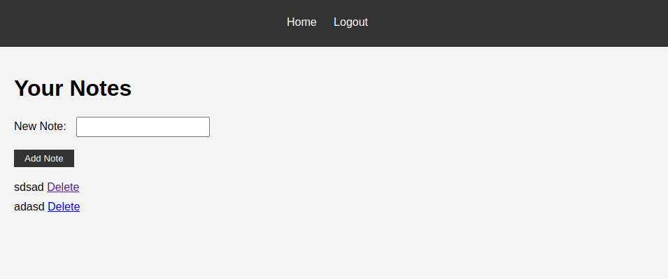

# Kubernetes Example App
This is a very simple note storing app. It serves as an example application for a kubernetes setup.

The image is hosted at https://hub.docker.com/r/rrrugo/kube-example-app.

It uses:

* Gunicorn (Application Server)
* Flask (Backend Framework)
* SQLAlchemy (ORM)
* PostgreSQL (Database)

*Fun fact: The entire app was completely written by ChatGPT*

https://hub.docker.com/r/rrrugo/kube-example-app.
